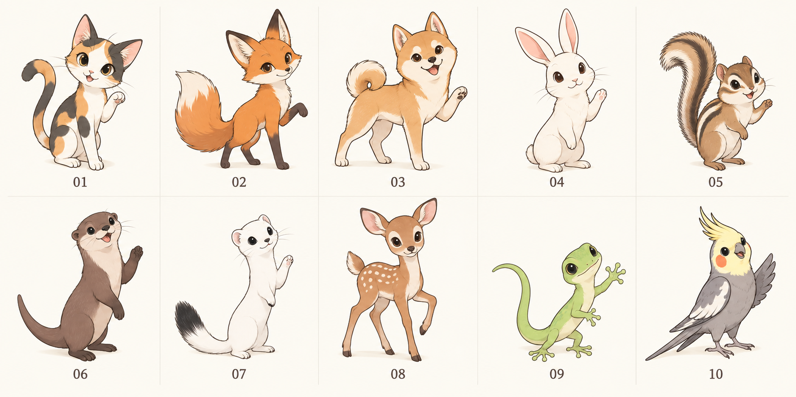

# 动物陪练方案 · 第二轮

共同方向：轻巧的身体、清楚的四肢轮廓，适度大头但不球形；表情友善、有一点小性格。使用动物自然毛色，避免靠夸张睫毛、粉色蝴蝶结或肌肉塑造性别。以下均为候选方案，尚未接入网站。

| 编号 | 角色 | 外形与性格 | 练习时的小动作 |
| --- | --- | --- | --- |
| 01 | 铃铃 · 三花猫 | 修长尾巴、奶白底三花、小巧三角脸；安静但好奇 | 一只前爪轻点键帽，完成后尾巴弯成问号 |
| 02 | 柚柚 · 赤狐 | 杏橙毛色、尖耳、纤细身形和蓬松长尾；机灵温暖 | 耳朵随敲字轻动，完成后甩尾转身 |
| 03 | 小麦 · 柴犬 | 浅麦色、挺耳、小卷尾，腿脚清楚；认真可靠 | 交替抬前爪，完成后点头摇尾 |
| 04 | 月月 · 白兔 | 长耳、细长身形和小前爪；温柔专注 | 耳朵微摆，完成后轻轻跳一下 |
| 05 | 栗栗 · 花栗鼠 | 背部条纹、细巧身体、弯曲蓬尾，不鼓腮；活泼 | 两只小爪快速敲，完成后尾巴竖起 |
| 06 | 溪溪 · 水獭 | 流线身形、长尾、小圆耳；灵巧爱玩 | 双爪轮流点键帽，完成后开心搓手 |
| 07 | 雪雪 · 白鼬 | 白色长身、黑尾尖、小短腿；有点呆又爱探头 | 伸长脖子看输入，完成后轻巧跃起 |
| 08 | 枝枝 · 梅花鹿 | 细腿、白色斑点、大耳朵，不加鹿角；安静亲近 | 耳朵转向你，完成后小步蹦跳 |
| 09 | 叶叶 · 壁虎 | 浅叶绿、细长弯尾、小脚趾；好奇又松弛 | 脚趾轮流点键，完成后尾巴画一个圈 |
| 10 | 乐乐 · 玄凤鹦鹉 | 浅灰身、黄色冠羽、橙色脸颊，细长尾羽；开朗 | 歪头听敲字，完成后竖冠羽、张翅 |

优先深化：01 三花猫（亲近感）、02 赤狐（轮廓鲜明）、07 白鼬（更特别且轻巧）。可先选角色，再制作待机、打字、庆祝及成长形态。
